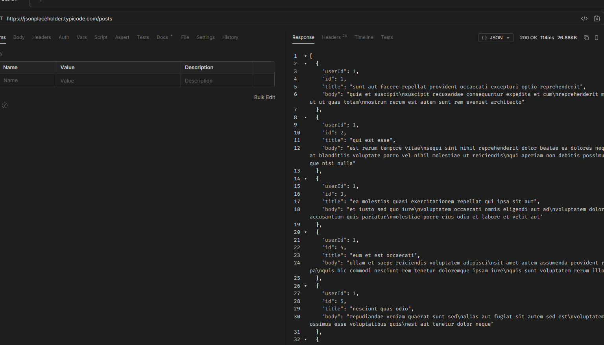
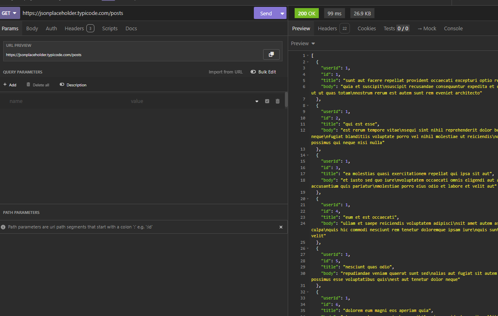
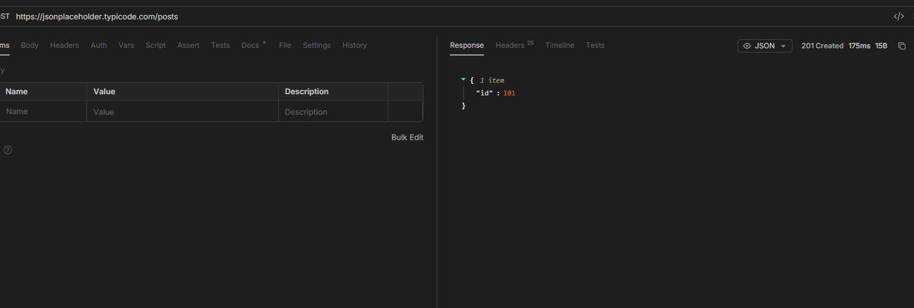
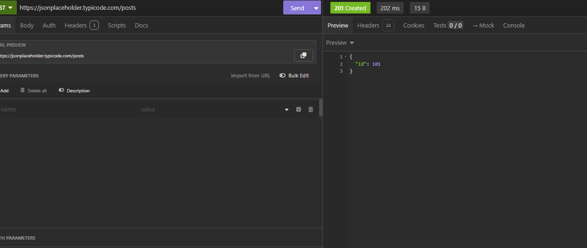
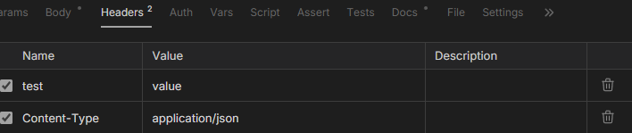
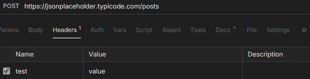
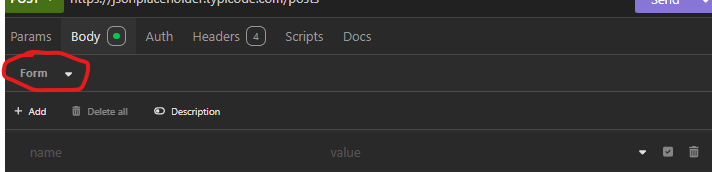

**🚀TP - 01. HTTP - Le jeu de piste**

**GET**

Comment est affichée la réponse ?
    les reponse son aficher dans un sertin forma et le choisire

Comment sauvegarder la requête ?
    Je n’ai pas trouvé.

Comment organiser les requêtes (dossiers/collections) ?
    pour Bruno et Insomnia les requetes son ranger dans des collections

**POST**

Ajouter Content-Type: application/json 

Comment ajouter des headers ?

Comment formater le corps de la requête ?

